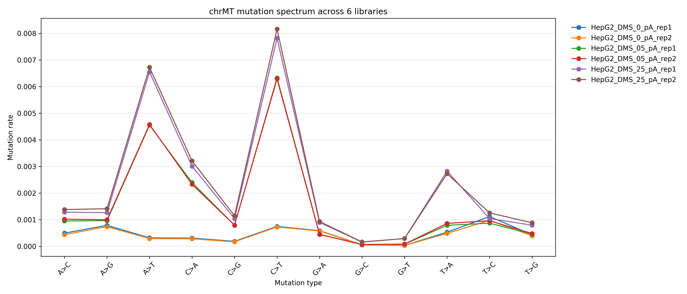
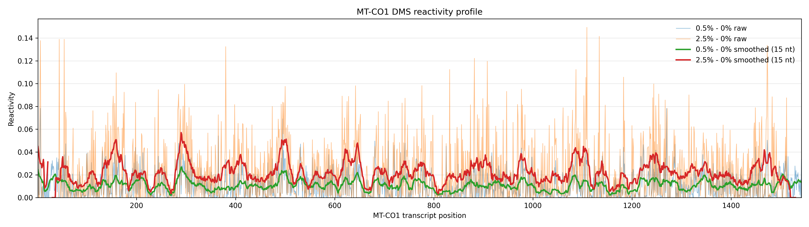
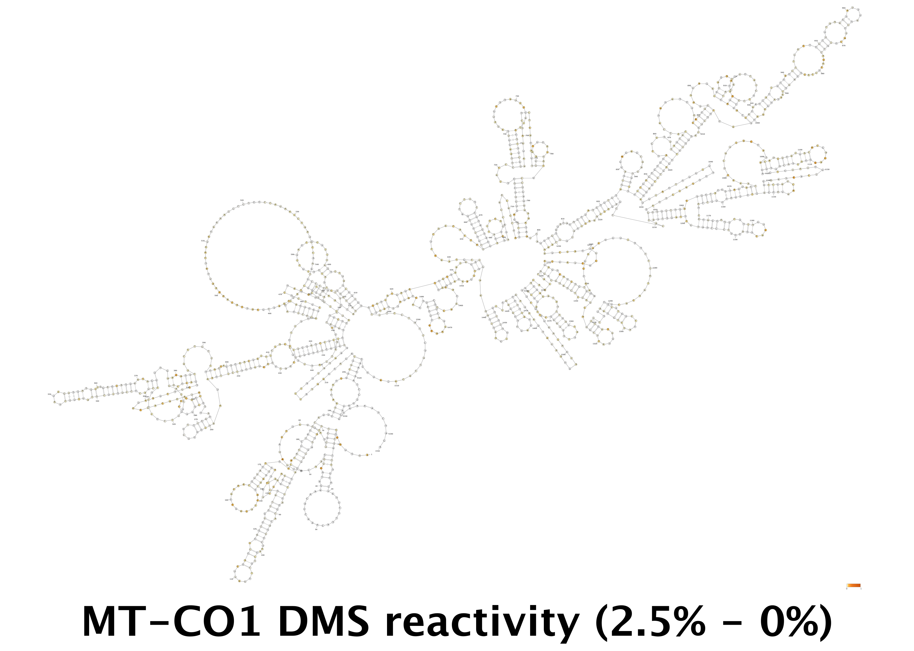

# README_DMS_structure_probing_1st_analysis_v2.md

## Overview
First-pass analysis of DMS RNA structure probing (Illumina PE150) in HepG2:
- 0%, 0.5%, 2.5% DMS (2 replicates each)

Goals:
- Validate DMS mutation signatures
- Quantify mutation rates genome-wide
- Derive per-nucleotide reactivity
- Visualize on MT transcripts (MT-CO1)

---

## Figures (render when paths exist)




---

## Step 1 — Trim + STAR mapping (exact commands)

```bash
raw_data="/g/data/lf10/rh1772/MAT2A/raw_data/Novogene_2026-Mar/X201SC26023330-Z01-F001/01.RawData"
analysis="/scratch/lf10/rh1772/MAT2A/analysis/RNAseq"
export PATH="/g/data/lf10/tools/miniconda3/envs/cutadapt/bin:$PATH"

for lib_pA in HepG2_DMS_0_pA_rep1 HepG2_DMS_0_pA_rep2 HepG2_DMS_05_pA_rep1 HepG2_DMS_05_pA_rep2 HepG2_DMS_25_pA_rep1 HepG2_DMS_25_pA_rep2; do
mkdir -p ${analysis}/${lib_pA}/
cutadapt -j 12 -a AGATCGGAAGAGCACACGTCTGAACTCCAGTCAC -A AGATCGGAAGAGCGTCGTGTAGGGAAAGA -m 35 -q 30,30 -o ${analysis}/${lib_pA}/${lib_pA}_R1.trimmed.fastq.gz -p ${analysis}/${lib_pA}/${lib_pA}_R2.trimmed.fastq.gz ${raw_data}/${lib_pA}/${lib_pA}_DKDL260001266-1A_23J5LKLT4_L2_1.fq.gz ${raw_data}/${lib_pA}/${lib_pA}_DKDL260001266-1A_23J5LKLT4_L2_2.fq.gz

cp ${analysis}/${lib_pA}/${lib_pA}_R*.trimmed.fastq.gz  ${PBS_JOBFS}/
mkdir -p ${PBS_JOBFS}/STAR
/g/data/lf10/as7425/apps/STAR-2.7.11b/bin/Linux_x86_64_static/STAR --runThreadN 16 --genomeDir /g/data/lf10/as7425/genomes/human_genome/star_index --outFilterMismatchNmax 4 --outSJfilterReads All --quantMode GeneCounts --outSAMattributes NH HI AS nM NM MD --outSAMreadID Number --readFilesCommand zcat --outSAMtype BAM SortedByCoordinate --outFileNamePrefix ${PBS_JOBFS}/STAR/${lib_pA}_STAR_ --readFilesIn ${PBS_JOBFS}/${lib_pA}_R1.trimmed.fastq.gz ${PBS_JOBFS}/${lib_pA}_R2.trimmed.fastq.gz

cp -R ${PBS_JOBFS}/STAR ${analysis}/${lib_pA}/
done
```

---

## Step 2 — Filter high-quality primary alignments

```bash
for lib_pA in HepG2_DMS_0_pA_rep1 HepG2_DMS_0_pA_rep2 HepG2_DMS_05_pA_rep1 HepG2_DMS_05_pA_rep2 HepG2_DMS_25_pA_rep1 HepG2_DMS_25_pA_rep2; do
  BAM=${analysis}/${lib_pA}/STAR/${lib_pA}_STAR_Aligned.sortedByCoord.out.bam
  FBAM=${analysis}/${lib_pA}/STAR/${lib_pA}_STAR_Aligned.primary.q20.bam

  samtools view -@ 16 -b -F 0x904 -q 20 "${BAM}" > "${FBAM}"
  samtools index -@ 16 "${FBAM}"
done
```

---

## Step 3 — Exons + mpileup mutation calling

### 3.1 Exon BED

```bash
references="/scratch/lf10/rh1772/references/GRCh38"
GTF=${references}/Homo_sapiens.GRCh38.115.chr.gtf

awk 'BEGIN{OFS="\t"}
$3=="exon" && $0~/gene_biotype "protein_coding"/ {
    print $1,$4-1,$5,".",".",$7
}' ${GTF} | sort -k1,1 -k2,2n | uniq | bedtools merge -s -c 6 -o distinct -i - > ${references}/Homo_sapiens.GRCh38.115.protein_coding_exons.stranded.merged.bed
```

### 3.2 mpileup

```bash
genome="/g/data/lf10/as7425/genomes/human_genome/Homo_sapiens.GRCh38.dna_sm.primary_assembly.fa"
OUTROOT=${analysis}/DMS_mutrates
mkdir -p "${OUTROOT}"

for lib_pA in HepG2_DMS_0_pA_rep1 HepG2_DMS_0_pA_rep2 HepG2_DMS_05_pA_rep1 HepG2_DMS_05_pA_rep2 HepG2_DMS_25_pA_rep1 HepG2_DMS_25_pA_rep2; do
  FBAM=${analysis}/${lib_pA}/STAR/${lib_pA}_STAR_Aligned.primary.q20.bam
  OUT=${OUTROOT}/${lib_pA}.primary.q20.Q30.muttype.tsv.gz

  samtools mpileup -aa     -f "${genome}"     -Q 30 -d 0     -l "${references}/Homo_sapiens.GRCh38.115.protein_coding_exons.stranded.merged.bed"     "${FBAM}" |   python3 ${scripts}/DMS_MAT2A/pileup_to_mutrate.py | gzip > "${OUT}"
done
```

---

## Step 4 — Downstream scripts

```bash
python3 ${scripts}/DMS_MAT2A/plotting_mutation_rate_per_type.py
python3 ${scripts}/DMS_MAT2A/make_mt_reactivity_table.py
python3 ${scripts}/DMS_MAT2A/plot_mt_co1_reactivity.py
python3 ${scripts}/DMS_MAT2A/fold_mt_co1_with_reactivity.py
python3 ${scripts}/DMS_MAT2A/make_varna_inputs.py
bash ${scripts}/DMS_MAT2A/MT-CO1.varna.command.sh
```

---

## Known caveats / fixes before rerun

### 1. STAR output inconsistency
- Pipeline uses BAM output (`SortedByCoordinate`)
- Old downstream code still references `.sam`
→ FIX: use BAM consistently

### 2. Nested mpileup loop bug
Original code:
```bash
for lib in all; do
  for lib in subset; do
```
→ Only inner loop runs

→ FIX: remove inner loop

### 3. Mismatch filter too strict
```bash
--outFilterMismatchNmax 4
```
→ May remove highly modified reads

→ RECOMMEND:
```bash
--outFilterMismatchNmax 10
```

### 4. AorC label outdated
Output file still named:
```bash
AorC.primary...
```
→ but pipeline now counts all mutation types

→ FIX: rename output for clarity

### 5. Reactivity clipping (visual only)
VARNA input clipped (e.g. 0.05)
→ affects visualization only, not data

---

## Summary
- DMS signal increases with concentration
- A/C mutation enrichment observed
- Replicates consistent
- MT transcripts provide strong validation signal

---

## Next steps
- genome-wide reactivity
- DMS-guided folding
- compare RT enzymes
